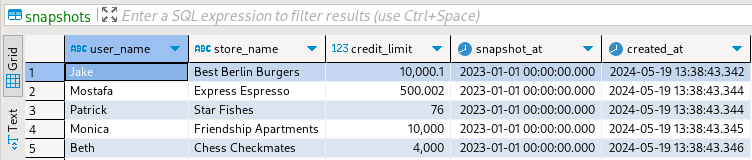

# Run ETL using Go from the command line

### Problem Statement

Design a tool that can import CSV files to a database by issuing a corresponding command with the following properties:

- `load` [raw files](../data/raw/) into Postgres
- `list` entities to analyze the discrepancy between loaded files in the table and the source directory (which were not uploaded)
- run a `sync` command to continuously monitor the folder, and in case of the file arrival - upload it to db

## Project Structure

The implementation is decoupled in the following modules:

```
├── api
├── cmd
├── db
└── util
```

### API

The module offers the core running [`state`](./api/api.go) of the application, [schema](./api/models.go) for reading CSV files, and finally, shared [functionality](./api/services.go) to upload, find the differences between files in the database and raw folder.

### CMD

Terminal user interface to interact with the application; The module uses the [Cobra](https://github.com/spf13/cobra) library to design commands. Configuration of the database interface occurs in the [root command](./cmd/root.go), and the [state](./api/api.go) is passed as a context value downstream to `add`, `list`, `sync` commands to avoid repeated code.

running help:

```bash
[$] ./cmd-etl help
Usage:
  cmd-etl [command]

Available Commands:
  add         Upload CSV files in the given path to Postgres.
  completion  Generate the autocompletion script for the specified shell
  help        Help about any command
  list        A list of relevant information about imported snapshots.
  sync        Watch source CSV file directory for new arrivals and upload new files to the db

Flags:
      --config string   config file (default is $HOME/.cmd-etl.yaml)
  -h, --help            help for cmd-etl
  -t, --toggle          Help message for toggle

Use "cmd-etl [command] --help" for more information about a command.
```

### DB

The crate responsible for database interaction uses [Postgres driver](https://github.com/jackc/pgx), and [Sqlc](https://github.com/sqlc-dev/sqlc) to generate type-safe code. To initialize the database - the migration files are predefined [here](./db/migration/)

### UTIL

Common functions that are shared across modules, the most important one probably [config](./util/config.go)

## Installation

Inside `cmd-etl` folder run the following

```bash
go build
```

## Running the application

### Upload files

```
[$] ./cmd-etl add snapshot_20230101.csv
4:37PM INF db migrated successfully
4:37PM INF total records processed - 6, rows discarded due to errors - 0
```

Results in the following table:



### List database state

```
[$] ./cmd-etl list
4:42PM INF db migrated successfully
4:42PM INF file `snapshot_20230603.csv` not loaded to db
4:42PM INF file `snapshot_20230101.csv` was uploaded to db at `2024-05-19 13:38:43.34634 +0000 UTC`
```

The previous command uploaded `20230101` file with `snapshot_at` column, querying the column gave information that `20230603` date was missing, so we have not processed the file.

### Sync files in folder upon arrival

For example, we drop a file `../data/raw/snapshot_20230603.csv` into `../data/raw/....` directory after running `./cmd-etl sync`. It will result in the following:

```
[$] ./cmd-etl sync
4:51PM INF db migrated successfully
4:51PM INF event: CREATE "../data/raw/snapshot_20230603.csv"
4:51PM INF modified file: ../data/raw/snapshot_20230603.csv
4:51PM INF file `snapshot_20230101.csv` was uploaded to db at `2024-05-19 13:51:19.130658 +0000 UTC`
4:51PM INF file `snapshot_20230603.csv` not loaded to db
4:51PM INF total records processed - 7, rows discarded due to errors - 0

```

## Usage Demo


